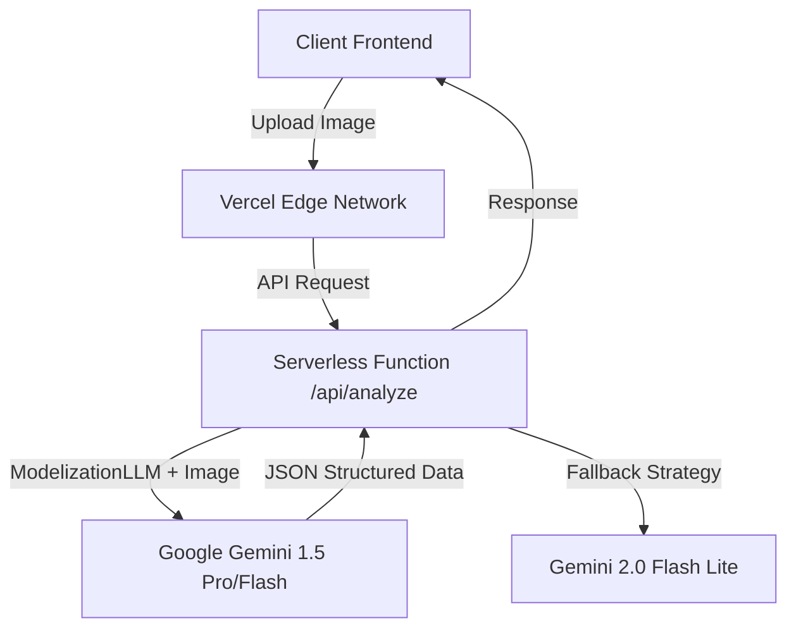

 

 

<h3>🚀 V1.3.6 (Golden Master) - Market Reality Pricing Engine</h3>

    <strong>Standardiser. Valoriser. Distribuer.</strong> 
    La première infrastructure IA capable de transformer une photo brute en une fiche produit B2B parfaite,  
    prête pour Vinted, eBay, Vestiaire Collective et BackMarket.
  

[Voir la Démo Live]() • [Architecture]() • [Roadmap]()

---

## 🔮 Vision

Le marché de la seconde main pèsera **350 Milliards $ en 2027**. Pourtant, le processus de mise en ligne reste manuel, lent et sujet à l'erreur humaine.

**SnapSell Studio** n'est pas un simple scanner. C'est un **Middleware Cognitif** qui utilise la Vision par Ordinateur et les LLM pour :

1. **Identifier** instantanément n'importe quel objet (Luxe, Tech, Streetwear).
2. **Évaluer** son prix réel sur le marché (et non le prix neuf théorique).
3. **Générer** un copywriting SEO expert et des fiches techniques prêtes à copier.

---

## ⚡ Fonctionnalités Clés (SnapSell Studio)

### 🧠 1. Moteur de Pricing "Real-Market" (V1.3.6)

Fini les estimations fantaisistes. Notre algorithme **"Anchor & Discount"** calibré sur la réalité :

- **Tech & Smartphones :** Détection automatique (iPhone 12 Pro, etc.). L'IA exige l'état de la batterie (%) et des rayures pour appliquer une décote brutale, s'alignant sur les prix _Sold Listings_ d'eBay et BackMarket.
- **Mode Luxe :** Analyse de la désirabilité et de la rareté pour Vestiaire Collective.

### 🎯 2. Marketplace Matching

L'IA ne vous dit pas juste _combien_ vendre, mais **OÙ** vendre.

> _"Cet article est un T-shirt Zara → Vinted (95% Match)"_ > _"Cet article est un iPhone 12 Pro → BackMarket (98% Match)"_

### 📸 3. Computer Vision Hybrid Pipeline

Analyse multi-vectorielle de l'image uploadée :

- **Grade Detection :** S (Neuf), A (Excellent), B (Bon), C (Correct).
- **Master Data Extraction :** Marque, Modèle, Matière, Couleur, Dimensions.

---

## 🏗 Architecture Technique

Le projet repose sur une architecture **Serverless** moderne pour garantir scalabilité et performance.

